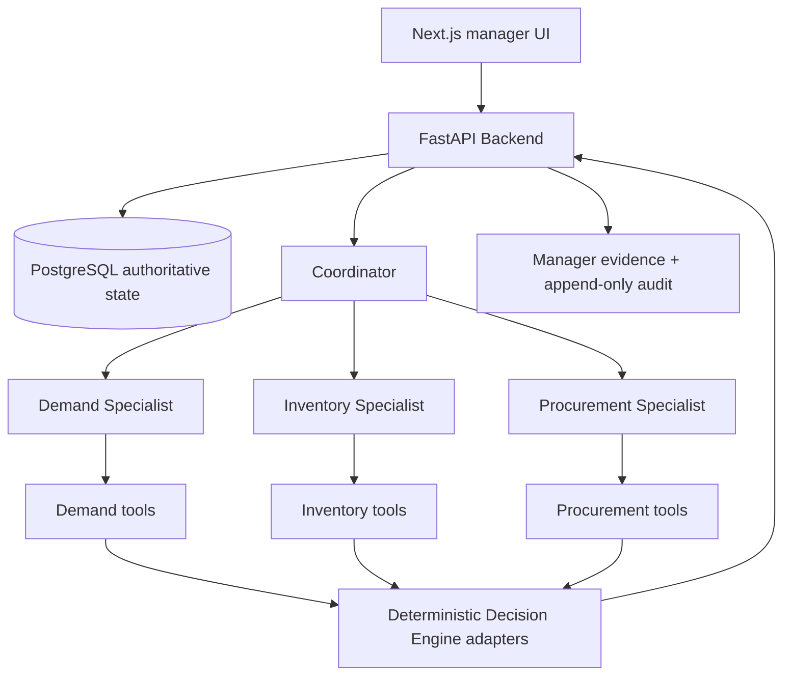

# ReStock

ReStock is a local, Backend-authoritative planning assistant for restaurants. It helps a manager reassess what to buy, how much, when, and from which approved supplier as demand, inventory, deliveries, promotions, and supplier conditions change.

## One-line pitch

ReStock turns changing restaurant facts into evidence-backed purchase recommendations with bounded specialist investigation, deterministic validation, and exact-version human approval.

## What is proven locally

The current branch contains a working local path for Procurement, Demand, and Inventory specialists; dynamic Coordinator routing; deterministic demand/inventory/procurement calculations; genuine `PENDING_APPROVAL` plan publication; supplier, promotion, delivery, and sales-materiality replanning; stale approval rejection; append-only audit history; manager evidence projections; and a provider-free evaluation/demo harness.

AI selects what needs investigation and when a plan should be reconsidered. Deterministic Python systems calculate and validate the candidate. The Backend is the only authority that validates state, publishes plan versions, applies lifecycle transitions, accepts approval, and persists audit records.

This repository is a local hardening/submission build. It does not claim live Sonnet/OpenClaw behavior, AWS/Bedrock behavior, deployed reliability, restaurant savings, or production SME outcomes.

## Architecture



The Coordinator may invoke specialists, but specialists cannot invoke other specialists or mutate Backend state. Each specialist has a narrow domain allowlist. Backend validation, publication, lifecycle, approval, and audit persistence remain outside prompts and specialist reasoning.

The application worker uses typed specialist reasoning through the organiser gateway, configured for Claude/Sonnet. OpenClaw remains an isolated smoke-test path and is not used by the application worker. The local demo can use scripted reasoning over the same contracts; live provider verification is still pending.

See [docs/ARCHITECTURE.md](docs/ARCHITECTURE.md), [docs/AGENTS_PLAN.md](docs/AGENTS_PLAN.md), and [CONTEXT.md](CONTEXT.md) for detailed contracts and glossary terms.

## Local setup

Requirements:

- Python 3.12+
- PostgreSQL 18-compatible local server
- Node.js 24.16–24.x
- pnpm 10.28.2

Backend:

```powershell
cd services/api
uv sync
Copy-Item .env.example .env
# Set distinct local MANAGER_PASSWORD and AGENT_TOKEN in .env.
uv run alembic upgrade head
uv run python -m src.seed
uv run uvicorn src.main:app --reload --port 8000
```

The seed is insert-only and safe to repeat for an existing database. Use a new database for a clean local run. The local demo reset helper is stricter: it only accepts a database name beginning with `restock_demo_` and truncates/reseeds that explicitly dedicated database.

Frontend:

```powershell
cd apps/web
pnpm install --frozen-lockfile
pnpm dev
```

The manager UI defaults to `http://localhost:8000` for the API and `http://localhost:3000` for the frontend. No agent credential belongs in frontend environment variables.

## Demo flow

The supported local golden demo uses only currently working flows:

1. Prepare a seven-scenario, evaluator-truth-free sheet.
2. Run supplier replanning, promotion routing, delivery disruption, safe and material inventory correction, sales-materiality fail-closed routing, and exact-version stale approval.
3. Review the active/pending recommendation, Coordinator routing, specialist/tool summaries, validation evidence, approval boundary, and Activity evidence timeline.
4. Repeat from the same dedicated `restock_demo_...` database; the runner resets and reseeds it before each system/scenario comparison.

```powershell
cd services/api
uv run alembic upgrade head
uv run python -m src.evaluation.local_demo prepare `
  --manifest tests/fixtures/evaluation/scenarios_v1.json `
  --output .tmp/golden-demo-preparation.json
uv run python -m src.evaluation.local_demo run `
  --manifest tests/fixtures/evaluation/scenarios_v1.json `
  --database-url postgresql+psycopg://.../restock_demo_local `
  --output .tmp/golden-demo-result.json
```

The inventory-adjustment route uses Backend PR #32's canonical event/context/assessment contract. The safe case keeps the current plan without Procurement; the material case reaches the real Procurement engine and publishes a revision.

See [docs/LOCAL_DEMO_SCRIPT.md](docs/LOCAL_DEMO_SCRIPT.md) for the concise rehearsal script and [docs/SCREENSHOT_VIDEO_CHECKLIST.md](docs/SCREENSHOT_VIDEO_CHECKLIST.md) for the capture plan. These documents do not perform capture or submission.

## Approval and safety boundary

Approval accepts an exact `plan_id` and `plan_version`. A new authoritative change invalidates the old review context; attempting to approve the stale version returns `PLAN_VERSION_STALE`. Approval does not place an order, create a purchase, or add inventory.

The local safety suite covers permission boundaries, prompt-injection attempts, unknown-data fail-closed behavior, bounded rounds/calls/retries, state-revision freshness, candidate validation, audit immutability, and absence of hidden chain-of-thought persistence. Manager evidence deliberately omits private prompts, scratchpads, raw frozen state, and secrets.

## Evaluation

The checked-in manifest contains 19 runnable scenario rows. It includes development and held-out splits and keeps expected truth separate from runtime inputs. The supported golden pass measures seven development scenarios across Static, Rule, and local Adaptive ReStock adapters: 21 executions, zero failed executions, stable observed-boundary fingerprints across two runs, and stale approval evidence with a persisted audit reference.

Fresh local verification on 19 September 2026 is recorded in [docs/evaluation/LOCAL_RESULTS_2026-09-19.md](docs/evaluation/LOCAL_RESULTS_2026-09-19.md). The complete PostgreSQL backend suite passed 782 tests. The database-independent synthetic-history suite passed 68 tests with an external temp root. Ruff, Pyright, Alembic upgrade/check, clean seed/reseed, and screenshot-disabled frontend evidence assertions also passed; frontend source was unchanged by this pass.

The local evaluation reports routing, outcome, specialist-call, tool-call, retry, latency, failure, and prompt-injection evidence only where the harness supports it. Live model calls, token usage, live latency/cost, and business outcomes are `pending` or `unsupported`, never zero-filled. The data is synthetic and first-slice; it is not evidence of food-waste reduction, stockout reduction, lost-sales reduction, procurement savings, emergency-order savings, or real restaurant performance.

## Current open items

- Run `python -m src.assessment_worker --loop` alongside the API for local queue polling; the one-shot command remains available. A hosted process supervisor and live-provider verification are still pending.
- Persisted human-review request workflow semantics, which remain undefined by the Backend contract.
- Live organiser-gateway/Sonnet behavior, AWS/Bedrock verification, live token/cost metrics, and live-model evaluation.
- Deployment, production reliability, hosted URLs, video, screenshots, and external submission actions.
- Real-world restaurant and SME outcome metrics.

The current local status is tracked in [docs/AGENTS_TASKS.md](docs/AGENTS_TASKS.md).

## Project material

- [Architecture and routing contract](docs/ARCHITECTURE.md)
- [Local evaluation harness](docs/evaluation/LOCAL_HARNESS.md)
- [Measured local evaluation results](docs/evaluation/LOCAL_RESULTS_2026-09-19.md)
- [Local demo script](docs/LOCAL_DEMO_SCRIPT.md)
- [Submission material](docs/SUBMISSION_MATERIALS.md)
- [Backend setup and API notes](services/api/README.md)
- [Connected synthetic contingency first case](docs/BACKEND_CONTINGENCY_FIRST_CASE.md)
- [Frontend development and verification](apps/web/FRONTEND.md)
