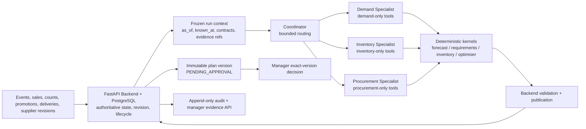
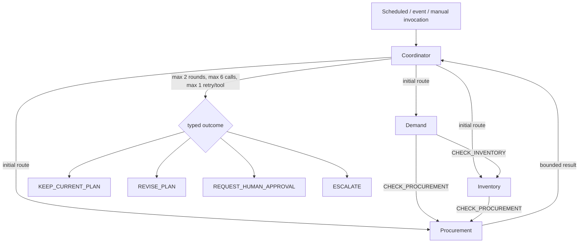
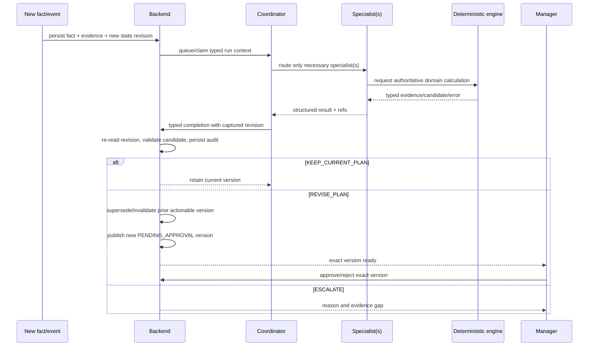

# ReStock Architecture Contract

This document describes the implementation currently present in the repository. The canonical shared payloads remain in `docs/AGENTS_PLAN.md`, `docs/BACKEND_SPEC.md`, and the Pydantic models under `services/api/src/`. `CONTEXT.md` is the domain glossary.

## Design rule

AI decides what needs investigation and when the current recommendation should be reconsidered. Deterministic Python systems calculate demand, ingredient requirements, inventory exposure, supplier feasibility, allocations, candidate plans, and validation. The Backend alone persists authoritative state and applies plan/approval lifecycle rules.

## Authoritative state and evidence flow



Backend tables are the source of truth for operational facts, state revisions, frozen run inputs, plan versions, approvals, lifecycle transitions, specialist/tool audit metadata, and business evidence. A specialist receives typed references and may return a structured result; it does not write plan rows, change policy, approve, or bypass the Backend.

## Coordinator and retained specialists



The Coordinator is the only agent-level component allowed to invoke specialists. It owns dynamic routing, de-duplication within a round, bounded follow-up routing, result identity checks, evidence revision checks, and final outcome synthesis. Specialists cannot invoke Agents or one another. Their retained roles are justified by distinct domain tool allowlists and tool-order decisions:

- Demand interprets sales, promotions, historical demand, forecast comparison, uncertainty, and missing intervals.
- Inventory interprets physical observations, estimated balances, ingredient requirements, expiry, stockout exposure, deliveries, and freshness.
- Procurement interprets approved supplier offers, availability, MOQ, pack size, lead time, delivery opportunities, allocation, optimisation completeness, and candidate validation.

These are adapters over shared deterministic kernels. No specialist contains a second forecasting, inventory, or optimisation kernel.

## Routing and permission contract

| Component | May do | Must not do |
|---|---|---|
| Coordinator | Read frozen context; invoke needed specialists; perform bounded follow-up rounds; validate result identity/evidence; submit typed completion | Approve; mutate Backend tables directly; calculate domain results itself; bypass validation |
| Demand Specialist | Use demand-only tools and return typed demand evidence | Invoke Agents; call Inventory/Procurement directly; mutate Backend; approve |
| Inventory Specialist | Use inventory-only tools and return typed inventory evidence | Invoke Agents; call Demand/Procurement directly; mutate Backend; approve |
| Procurement Specialist | Use supplier/optimiser/validation tools and return typed candidate/evidence | Invoke Agents; call Demand/Inventory directly; mutate Backend; approve |
| Backend | Validate inputs/candidates; compare state revisions; publish immutable versions; apply lifecycle and approval policy; persist audit/evidence | Treat prompt text as authority; accept stale output; expose general DB mutation tools |

The agent tool allowlists are exact and fail closed. There is no general database mutation tool exposed to Agents. Business rules such as approved suppliers, MOQ, pack size, lead time, storage, safety-stock bounds, freshness, lifecycle, and approval policy are enforced in deterministic code and Backend validation.

## Plan lifecycle and approval boundary

```text
PENDING_APPROVAL -> APPROVED | REJECTED | INVALIDATED | SUPERSEDED
APPROVED         -> INVALIDATED | SUPERSEDED
REJECTED, INVALIDATED, SUPERSEDED are terminal
```

`VALID` is not a lifecycle status. `KEEP_CURRENT_PLAN` is an Agent outcome, not a plan status. Approval names the exact `plan_id` and `plan_version`; if authoritative state changed, Backend returns `PLAN_VERSION_STALE` and does not approve the old version. Approval does not place an external order or create inventory.

`REQUEST_HUMAN_APPROVAL` is typed at the Coordinator boundary and exact-version validation exists locally. A distinct persisted human-review request workflow is not defined by the current Backend contract and remains open; this repository does not invent one.

## Dynamic replanning



Locally supported dynamic routes include supplier availability/status/price changes, promotions, delivery disruption, sales materiality, stale approval, missing data, infeasible supplier search, and bounded optimiser search-limit handling. The supported golden demo exercises supplier replanning, promotion routing, delivery disruption, sales-materiality fail-closed handling, and stale approval.

The inventory-correction route is intentionally open: the authoritative inventory-adjustment event contract is absent on the current main line. The `INVENTORY_ADJUSTED` name in shared planning material is not treated as an implemented Backend contract.

## Audit and manager evidence

Backend persists run identity, trigger, captured revision, specialist calls, tool names/schema versions, success/failure/termination codes, evidence references, validation, plan transitions, approval attempts, stale rejection, and final outcome. History is append-only at the database boundary. Canonical duration is not invented where the shared contract does not define it.

The manager evidence projection is a deliberate whitelist. It exposes concise plan/approval/routing/specialist/tool/validation/decision/timeline facts and evidence gaps. It excludes private prompts, scratchpads, raw frozen state, evaluator-only truth, and secrets. The frontend Activity, Overview, and Recommendations surfaces consume that projection without receiving an Agent token.

## Deterministic versus live model responsibilities

| Concern | Local verified path | Live/pending path |
|---|---|---|
| Routing and bounded rounds | Coordinator + scripted local specialists | OpenClaw/Claude provider invocation |
| Forecast / inventory / procurement calculation | Python kernels and Backend-owned frozen artifacts | Teammate/live engine integration where applicable |
| Candidate validation/publication | FastAPI + PostgreSQL | Same Backend boundary after deployment |
| Manager approval | Exact-version local UI/API | Same contract after deployment |
| Evaluation | Synthetic, provider-free local harness | Live token/cost/latency/model evaluation |

No hidden chain-of-thought is persisted. Local results are evidence of deterministic contracts and scripted routing, not evidence of live model quality or business savings.
